# NewProjectilesAPI

This mod offers many new possibilities for projectiles, including homing, the ability to shoot and launch multiple projectiles simultaneously, ability to follow that caster, as well as the ability to perform an action during the flight of the projectile.

This mod is a framework, by itself does not add anything to the game. The authors of magic/combat mods will be able to use it to improve their mods with new cool projectiles.

In the json file you specify the properties of the new projectiles, see the [wiki](https://github.com/fenix31415/NewProjectilesTMP/wiki) for more information. There are also [examples](https://github.com/fenix31415/NewProjectilesTMP/tree/master/examples) of settings files.

In a nutshell, the mod does the following. When some events are triggered, under certain conditions, you can launch the projectile(s), change the type of projectile.

Here are some features of this mod:

* Homing projectiles: Projectiles can now chase their target, making each shot more accurate and deadly.

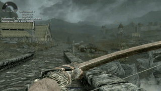

* Multiple shot: You can fire multiple projectiles at the same time, creating a flurry of arrows or magic charges.

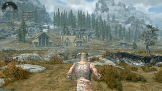

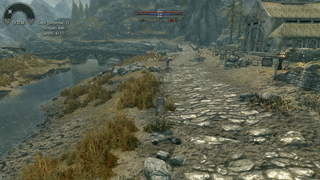
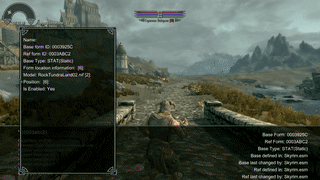

* Followers: This new type of projectile will follow you, creating unique tactical opportunities.

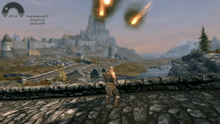

* Emitter: You can configure the projectiles so that they perform certain actions during flight, for example, change their speed or direction, cast other projectile.

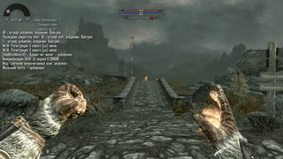
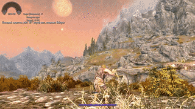

The main advantage is it is possibly to mix all those features!

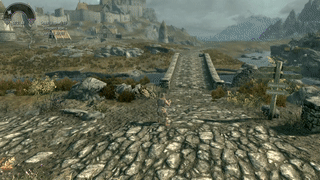

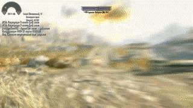
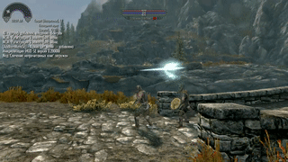
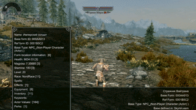

Thanks to flexible settings, you can create new projectiles by combining these functions, which opens up endless possibilities for customizing your mod.
