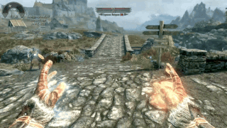
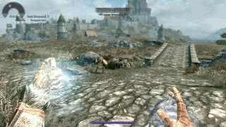
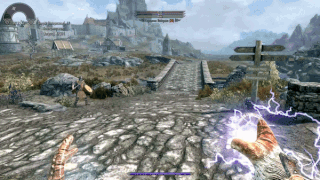

# NewProjectilesAPI

This mod offers many new possibilities for projectiles, including homing, the ability to shoot and launch multiple projectiles simultaneously, ability to follow that caster, as well as the ability to perform an action during the flight of the projectile.

This mod is a framework, by itself does not add anything to the game. The authors of magic/combat mods will be able to use it to improve their mods with new cool projectiles.

In the json file you specify the properties of the new projectiles, see the [wiki](https://github.com/fenix31415/NewProjectilesTMP/wiki) for more information. There are also [examples](https://github.com/fenix31415/NewProjectilesTMP/tree/master/examples) of settings files.

## Installation

* Go to [releases](https://github.com/fenix31415/NewProjectilesTMP/releases), pick the latest one and download `NewProjectilesTMP.zip`.
* Install this archive as regular mod.
* If you are mod author, read the [wiki](https://github.com/fenix31415/NewProjectilesTMP/wiki) and try [examples](https://github.com/fenix31415/NewProjectilesTMP/tree/master/examples).

## Features

In a nutshell, the mod does the following. When some events are triggered, under certain conditions, you can launch the projectile(s), change the type of projectile.

Here are some features of this mod:

### Homing projectiles

Projectiles can now chase their target, making each shot more accurate and deadly.

### Multiple shot

You can fire multiple projectiles at the same time, creating a flurry of arrows or magic charges.

### Followers

This new type of projectile will follow you, creating unique tactical opportunities.

### Emitter

You can configure the projectiles so that they perform certain actions during flight, for example, change their speed or direction, cast other projectile.

The main advantage is it is possibly to mix all those features!

Thanks to flexible settings, you can create new projectiles by combining these functions, which opens up endless possibilities for customizing your mod.

## Plans

if you have an **idea** of some necessary for you function or event, or just an idea to improve the mod, feel free to **share** it!

There is a list of my ideas, which are not implemented yet. And my thoughts about them.

* Checking conditions **while flight**. E.g. make some feature active only when certain condition is pass. But I cannot imagine any cool use-case for it.
* Allow follower projectiles float **around a cylinder** (currently implemented sphere and plane). Ahh, I cannot create math formula for smooth trajectory.
* Make Homing target **selection priority**: create ways to increase/decrease it. But I cannot imagine any cool use-case for it.
* Upgrade `AccelerateToMaxSpeed`: currently it have **poor acceleration formula**. I used it to catch enemies' projectiles and throw them back. How it can be used?
* I made an attempt to create an **editor** for it. But unfortunately it took too many time, so I stopped. There is also json schema-based editor generators. Unfortunately all ones I found support draft-04. The schema is draft-12. Maybe I'll accumulate time and power to make another attempt.\
Anyway, I created a schema, in VS Code you just need to press Ctrl+Space to create your json. VS Code validates it for you, show errors & tooltips that I wrote.

## Bugs

If you found a bug in docs/in schema/in the mod -- feel free to share.

Here some known issues.

* When Figure's normal looks straight up, the shape **do not rotates** with the caster/proj/whatever. For now, if you want rotation, use `"normal": [0,0.01,1]`.
* If you create more followers than the number of points in the Figure, the remaining followers **have a zero index**. So, all of them will follow (or fly around) **single point** (which have 0 index in the Shape).\
I do not know how to fix it. At the same time it is possible to have multiple groups of followers, with different shaped. I can iterate every follower, but I cannot get the figure by the follower. So it is impossible for me to get the "smallest the most free index of the follower's shape" by a follower.\
A possible solution is to **iterate all** of them, determine a figure, get the smallest index. But I want to avoid iterating every creation.
As an optimization, it could be done for multicast of followers. But I do not think it is worth it.

## Changelog

### New in 1.2.0

#### General

* Fixed CTD with loading **permanent runes**.
* **Optimized** GetCollisionLayer hooks.
* `conditions` field in `Triggers` is **optional**.

#### Followers

* Fixed a bug with **smooth** Follower rotating. ~~again~~.

#### Multicast

* Added **initial rotation** [To target](Multicast#spawn-group-rotation) (defined by the Homing feature).
* Sound position **fix**. ~~again~~.

#### Homing

* Flame projectiles (e.g. flames, frost spells) **disable aim** if target is dead or too far away.

#### Jsons

* Added **[multiple](important-notes) json** support. You can use your own file.
* Added **json validation** with schema on load. If there is any invalid json, load/reload cancelled. I still insist that you use schema validation in VS Code too.

#### Settings

* Added **settings**.
* Added option for **reload json hotkey**. Supports combinations with shift, ctrl, alt. Default: `Ctrl+Shift+Q`.

#### New Events

* `ProjDestroyed`. After hit/end of lifetime/end of range.
* `ProjImpact`. A projectile hits someone or something.
* `EffectEnd`. Actor get dispelled an effect.

#### New Conditions

* `EffectHasKwd` now works with `ProjAppeared` event.

#### New Trigger Functions

* `Placeatme`: spawn something near to trigger.
* `SendAnimEvent`: notify behavior graph of trigger.
* `Explode` at trigger position.
* `ChangeSpeed` is working in triggers, also simplified code regarding it.
* `SetColLayer`: change collision type of a projectile. E.g. fly through walls.
* `ChangeRange` works for flame and beam projectiles.
